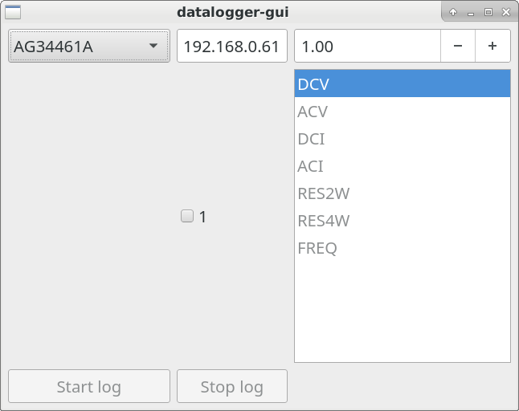

# datalogger-gui

A GUI interfaced software to log multiple instruments via ethernet, usb or serial connection.

`./datalogger-gui.py`



## Usage

- Select the instrument to log
- Check the IP/serial/usb address
- enter a sample time (default = 1)
- select a channel
- precise the type
- press start

## Saving Tree

Each daily file is saved in a tree as following:
```
current folder
└── YYYY
	└── YYYY-MM
	    └── YYYYMMDD-hhmmss-instrument.dat
```
